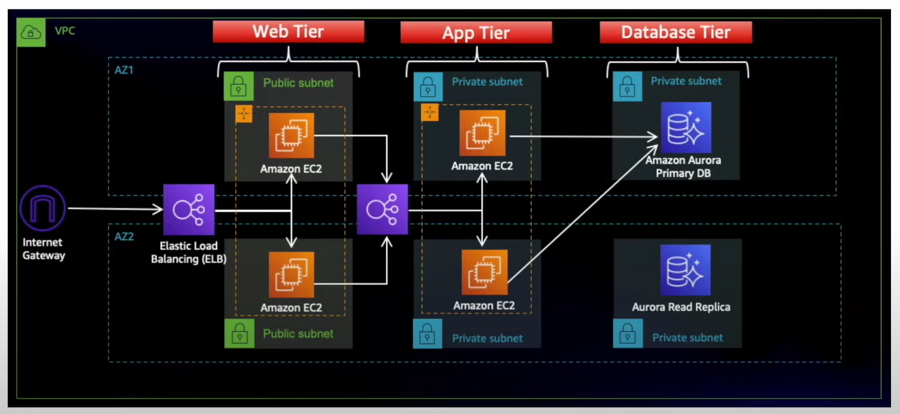

# three-tier-architecture-aws

This project demonstrates the implementation of a three-tier architecture on AWS, which separates the application into three layers:

Presentation Layer → Web/App servers (EC2)

Application Layer → Application logic (private EC2)

Database Layer → Amazon RDS

## 📌 Architecture Diagram  

## Networking and security setup :

1. VPC (Virtual Private Cloud)

   Created a custom VPC to isolate the infrastructure.

   CIDR Block: 192.172.0.0/22

2. Subnet Design

   Created 6 subnets across 2 Availability Zones for high availability:

   2 Public Subnets → Host Load Balancer & Web EC2s.

   2 Private App Subnets → Host Application Layer EC2s.

   2 Private DB Subnets → Host Amazon RDS and replicas.

   This ensures multi-AZ redundancy and separates each tier logically.

3. Internet Gateway & NAT Gateway

   Internet Gateway (IGW) → Create 1 internet gateway that Enables inbound/outbound traffic for public subnets.

   NAT Gateway (in public subnet) → We create 1 nat gateway in public subnet to allow private subnets (App + DB) to access the internet securely for software updates, without exposing them publicly.   (only using 1 nat gateway to make the project cost efficient)

4. Route Tables

   Public Route Table → Routes 0.0.0.0/0 traffic via IGW for public subnets.

   Private Route Table (App) → Routes outbound traffic via NAT Gateway.

   Private Route Table (DB) → No direct internet route. Only internal communication allowed.

5. Security Groups

   we will create 5 security groups -

  🔹 External ALB SG

   Inbound: Allow HTTP (80), HTTPS (443) from internet.

   Outbound: Forward traffic to Web Tier SG.

  🔹 Web Tier SG

   Inbound: Allow traffic only from External ALB SG.

   Outbound: Allow traffic to Internal ALB SG.

  🔹 Internal ALB SG

   Inbound: Allow traffic only from Web Tier SG.

   Outbound: Forward traffic to App Tier SG.

  🔹 App Tier SG

   Inbound: Allow traffic only from Internal ALB SG (on app port, 4000).

   Outbound: Allow traffic to DB Tier SG.

  🔹 DB Tier SG

   Inbound: Allow MySQL/Aurora port (3306) only from App Tier SG.

   Outbound: Restricted (default).

## S3 Bucket Setup :

   Created an S3 bucket to store application code/artifacts.

   Uploaded the deployment package (e.g., index.html, application zip/jar, etc.) to the bucket.

   This bucket will act as the source for EC2 instances during deployment.

## IAM Role Setup for EC2 :

   To keep EC2 instances in private subnets secure and functional, IAM roles are attached instead of using a Bastion Host.

   AmazonSSMManagedInstanceCore → Allows secure connection to EC2 via AWS Systems Manager Session Manager (no SSH or public access needed).

   AmazonS3ReadOnlyAccess → Grants EC2 permission to read code/artifacts from S3 during deployment.

## Flow :

   Application code is stored in the S3 bucket.

   EC2 (Web/App tier) with the IAM Role pulls code from S3.

   Admins connect to EC2 securely using SSM Session Manager (no public IP or jump server required).

This setup is secure, simple, and production-ready.

